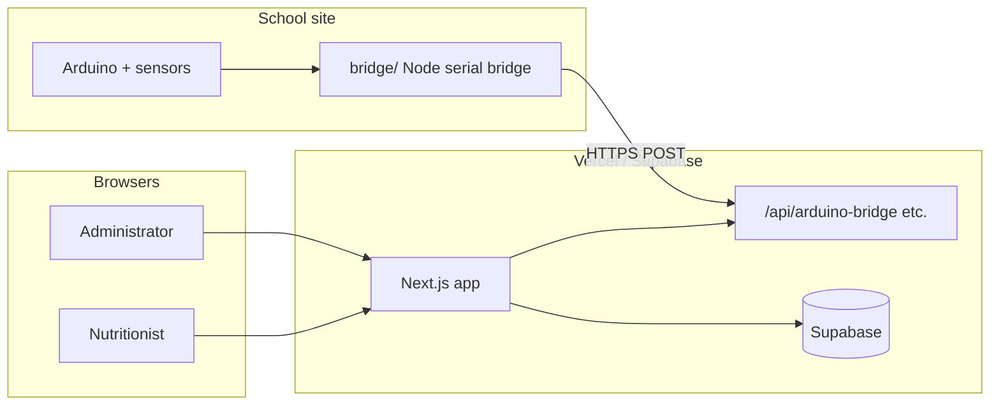

# GROWTHetect — Project Documentation

## Project title

**GROWTHetect** (package name: `growthetect-nextjs`)

A school nutrition and growth monitoring web application, converted from a legacy PHP stack to **Next.js 14**. It supports nutritionists and administrators in tracking student BMI, managing feeding programs, generating reports, and integrating **Arduino-based height/weight sensors** via a local bridge service.

**Production URL (example):** [https://capstone-growthetect.vercel.app](https://capstone-growthetect.vercel.app)

---

## Overview

GROWTHetect helps schools monitor child growth and nutrition outcomes. Users log in with role-based access, record and analyze BMI data, run feeding programs, export reports (CSV/PDF), and optionally capture measurements from IoT hardware (ultrasonic height, load cell weight, RFID) through an on-site **Arduino bridge** that posts readings to the cloud API.

The project originated as a **capstone conversion**: same business goals as the original PHP app, rebuilt with modern React/Next.js patterns, JWT auth, and Supabase as the primary database.

---

## Tech stack

| Layer | Technology |
|--------|------------|
| **Framework** | Next.js 14 (App Router) |
| **UI** | React 18, TypeScript |
| **Styling** | Tailwind CSS, custom global styles |
| **Animation** | Motion |
| **Database** | [Supabase](https://supabase.com/) (PostgreSQL via `@supabase/supabase-js`) |
| **Auth** | JWT in HTTP-only cookies (`jose` in middleware, `jsonwebtoken` in API routes), `bcryptjs` for passwords |
| **Email** | Nodemailer (Gmail app password) — 2FA codes, password reset |
| **Reports** | jsPDF, jsPDF-AutoTable; CSV generation via API routes |
| **IoT bridge** | Node.js (`bridge/`) — Serialport, posts to `/api/arduino-bridge` |
| **Hardware** | Arduino + sensors (e.g. ultrasonic height, YZC-516C load cell / HX711, RFID) |
| **Deployment** | Vercel (web app); school PC runs the bridge locally |

---

## Main functions

### Authentication and accounts

- Login / signup for **nutritionist** and **administrator** roles
- Route protection via `middleware.ts` (public: `/login`, `/forgot-password`)
- Optional **2FA** (send/verify code via email)
- Forgot password (send code, reset)
- Profile update, change password, account deactivation
- Session via `auth_token` cookie; role-based redirect from home (`/`)

### Student and BMI management

- Student registration and CRUD (`/api/students`)
- BMI records create/list/filter (`/api/bmi-records`, `/bmi-tracking`)
- Yearly BMI trends, KPI summary, promotion sessions
- Maintenance utilities (e.g. sequence/HFA fixes) for data integrity

### Dashboards

- **Nutritionist:** overview, BMI tracking, feeding program, reports, profile
- **Administrator:** dashboard, student registration, reports, profile

### Feeding program

- Feeding program data API (`/api/feeding-program`)
- Feeding list and feeding program report generation (PDF/CSV APIs)

### Reports

- List, view, download, upload PDF
- Generate CSV (`/api/reports/generate-csv`)
- Generate PDF reports (`/api/reports/generate-pdf`)
- View CSV, feeding program reports

### IoT and calibration

- **Arduino bridge API** (`/api/arduino-bridge`) — receives height/weight from the school bridge
- **RFID scan** (`/api/rfid-scan`) — associate scans with workflow
- Calibration command/result endpoints for sensor setup
- Debug logs API for troubleshooting hardware integration

### Other

- Dashboard statistics (`/api/dashboard`)
- User management (`/api/users`)
- Migration/password-reset helper routes (admin/migration flows)
- Supabase connectivity test route (development)

---

## User roles

| Role | Typical access |
|------|----------------|
| **Nutritionist** | Overview, BMI tracking, feeding program, reports, own profile |
| **Administrator** | Admin dashboard, student registration, reports, admin profile |

Unauthenticated users are redirected to `/login`.

---

## System architecture (high level)



1. **Browsers** use the Next.js app (pages under `app/`).
2. **API routes** under `app/api/` handle auth, data, reports, and sensor payloads.
3. **Supabase** stores application data (configured via env vars).
4. **Bridge** runs on a PC at the school, reads serial data from Arduino, and POSTs JSON to the deployed `/api/arduino-bridge` endpoint (or localhost during development).

For deeper hardware setup, see also: `ARDUINO_BRIDGE_SETUP.md`, `QUICK_START_BRIDGE.md`, `PRODUCTION_DEPLOYMENT_GUIDE.md`, `LOAD_CELL_CALIBRATION_GUIDE.md`, `RFID_COMPLETE_SETUP_GUIDE.md`.

---

## Project structure

```
next.js_capstone_convertion/
├── app/                      # Pages and API (App Router)
│   ├── api/                  # REST-style route handlers
│   ├── login/, signup/, ...
│   ├── nutritionist-overview/, admin-dashboard/, ...
│   └── layout.tsx, globals.css
├── components/               # Shared UI (sidebars, PDF helpers, ui/)
├── lib/                      # db (Supabase), auth, email, helpers
├── bridge/                   # Local Arduino → API bridge (serialport)
├── middleware.ts             # JWT route protection
├── public/                   # Static assets
├── package.json
└── PROJECT_DOCUMENTATION.md  # This file
```

---

## Setup (development)

### Prerequisites

- **Node.js 18+**
- **npm** (or yarn)
- **Supabase project** (URL + anon key)
- For IoT: Arduino firmware, USB cable, optional calibration guides in repo root

### 1. Install web app dependencies

```bash
cd "c:\4th year\next.js_capstone_convertion"
npm install
```

### 2. Environment variables

Create `.env.local` in the project root (do not commit secrets):

```env
# Supabase (required)
NEXT_PUBLIC_SUPABASE_URL=https://your-project.supabase.co
NEXT_PUBLIC_SUPABASE_ANON_KEY=your-anon-key

# Auth (required in production)
JWT_SECRET=your-long-random-secret

# Email (for 2FA / password reset)
GMAIL_USER=your@gmail.com
GMAIL_APP_PASSWORD=your-app-password
```

Optional aliases used in code: `SUPABASE_URL`, `SUPABASE_ANON_KEY`.

> **Note:** Older docs may mention MySQL (`DB_HOST`, etc.). The current codebase uses **Supabase** via `lib/supabase.ts` and `lib/db.ts`.

### 3. Run the development server

```bash
npm run dev
```

Open [http://localhost:3000](http://localhost:3000). Logged-in users are routed by role; others go to `/login`.

### 4. Arduino bridge (optional)

On the school machine (or dev PC with Arduino connected):

```bash
cd bridge
npm install
# Configure serial port and API URL in bridge script / env per ARDUINO_BRIDGE_SETUP.md
node arduino-bridge.js
```

Point the bridge at `http://localhost:3000/api/arduino-bridge` for local testing, or your Vercel URL for production.

### 5. Build and production run

```bash
npm run build
npm start
```

Lint:

```bash
npm run lint
```

---

## Deployment

- **Web app:** Deploy to **Vercel** (or any Node host that supports Next.js 14).
- Set all environment variables in the hosting dashboard (same as `.env.local`, especially `JWT_SECRET` and Supabase keys).
- **Bridge:** Keep running on a physical PC at the school; it is not deployed to Vercel.
- See `PRODUCTION_DEPLOYMENT_GUIDE.md` and `TESTING_LOCALHOST_AND_PRODUCTION.md` for end-to-end checks.

---

## NPM scripts

| Script | Command | Purpose |
|--------|---------|---------|
| `dev` | `next dev` | Local development |
| `build` | `next build` | Production build |
| `start` | `next start` | Run production server |
| `lint` | `next lint` | ESLint (Next.js config) |

---

## Security notes

- Use a strong `JWT_SECRET` in production.
- Cookies use `secure` in production (`NODE_ENV === 'production'`).
- Do not commit `.env.local`, Gmail passwords, or Supabase service role keys to git.
- Arduino bridge endpoint should only accept trusted sources in production (network/firewall as appropriate).

---

## Related documentation in this repository

| Document | Topic |
|----------|--------|
| `README.md` | Quick intro (partially legacy MySQL wording) |
| `CONVERSION_GUIDE.md` | PHP → Next.js conversion notes |
| `STATUS.md` | Conversion checklist (may be outdated) |
| `PRODUCTION_DEPLOYMENT_GUIDE.md` | Vercel + bridge production |
| `ARDUINO_BRIDGE_SETUP.md` | Bridge installation |
| `SUPABASE_STORAGE_SETUP.md` | Storage configuration |
| `README_ONE_CLICK.md` / `ONE_CLICK_SETUP.md` | Simplified startup |

---

## Version

- Application version: **1.0.0** (`package.json`)
- Last updated for this doc: project state as of the Next.js + Supabase + Arduino bridge integration.

---

## Team / context

Capstone project: **next.js_capstone_convertion** — modernization of GROWTHetect for improved maintainability, type safety, cloud hosting, and hardware-integrated BMI capture at the school site.
